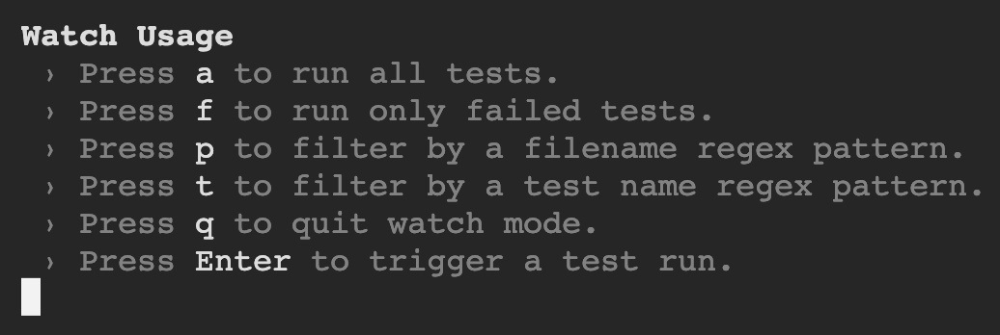

This is a new [**React Native**](https://reactnative.dev) project, bootstrapped using [`@react-native-community/cli`](https://github.com/react-native-community/cli).

# 🆕 Last added components

<!-- COMPONENT_LIST -->

# Getting Started

> **Note**: This repository it's been created to show how to configure a testing environment for React Native using Jest and React Native Testing Library.

## 📚 How to use this repository

1. [Fork](https://github.com/aiherrera/reactnative-template-starter/fork) this repository
2. Check the available components in the `Last added components` section above 👆
3. Read the [Card Information](https://github.com/users/aiherrera/projects/10) from the project, to get an idea of the business rules (each component would have attached the link to it's own card)
4. Develop your test cases for the component(s)
5. Test cases for each component must be inside the `__tests__` folder following the same structure that is inside of `src/components`
6. Create a `branch` for each test use case within the following format `github_username/component_name` ex: `aiherrera/button`, `aiherrera/link`, etc
7. Raise a PR to the [develop](https://github.com/aiherrera/reactnative-template-starter/tree/develop) branch with your changes


# Steps for setting the project

## 🚀 Step 1: Launch the Metro Server

First, you will need to start **Metro**, the JavaScript _bundler_ that ships _with_ React Native.

To start Metro, run the following command from the _root_ of your React Native project:

```bash
# using npm
npm start

# OR using Yarn
yarn start
```

## 📱 Step 2: Run your Application in a device or emulator

Let Metro Bundler run in its _own_ terminal. Open a _new_ terminal from the _root_ of your React Native project. Run the following command to start your _Android_ or _iOS_ app:

### For Android

```bash
# using npm
npm run android

# OR using Yarn
yarn android
```

### For iOS

```bash
# using npm
npm run ios

# OR using Yarn
yarn ios
```

If everything is set up _correctly_, you should see your new app running in your _Android Emulator_ or _iOS Simulator_ shortly provided you have set up your emulator/simulator correctly.

This is one way to run your app — you can also run it directly from within Android Studio and Xcode respectively.

## 🛠️ Step 3: Testing zone

These are the steps followed to configure the testing environment:

### Install required libraries

```bash
yarn add --dev jest @testing-library/react-native @testing-library/jest-native
```

### Add types for Jest

```bash
yarn add --dev @types/jest
```

### Add the matchers to your jest.config.js file:

```javascript
module.exports = {
  preset: 'react-native',
  + setupFilesAfterEnv: ['@testing-library/jest-native/extend-expect'],
}
```

### Create a component button

```javascript
// src/components/button.tsx
import React, { FC } from 'react'
import { TouchableOpacity, Text } from 'react-native'

interface MyButtonProps {
  text?: string;
}

const MyButton: FC<MyButtonProps> = ({ text = 'Press Me' }) => {
  return (
    <TouchableOpacity>
      <Text>{text}</Text>
    </TouchableOpacity>
  )
}

export default MyButton
```

### Create a test for the component button

```javascript
// __tests__/components/button.test.tsx
import 'react-native'
import React from 'react'
import { render } from '@testing-library/react-native'
import MyButton from '../../src/components/button'

describe('<MyButton />', () => {
  it('should render the button text', () => {
    const { getByText } = render(<MyButton text="Press Me" />)

    const label = getByText('Press Me')
    expect(label).toBeTruthy()
  })
})
```

### Configure scripts in package.json

```json
"scripts": {
    "test": "jest",
    "test:watch": "jest --watch",
    "test:coverage": "jest --coverage"
  },
```

## ✍️ Developer notes:

- `test` will run all the tests once
- `test:watch` will run all the tests and will watch for changes
- `test:coverage` will run all the tests and will show the coverage

💡 Remember that when using the `--watch` flag, you are provided with several options to interact within the test runner:



## 🤓 Learn More

To learn more about React Native, take a look at the following resources:

- [React Native Website](https://reactnative.dev) - learn more about React Native.

- [Jest](https://jestjs.io/) - learn more about Jest.

- [React Native Testing Library](https://callstack.github.io/react-native-testing-library/) - learn more about React Native Testing Library.
